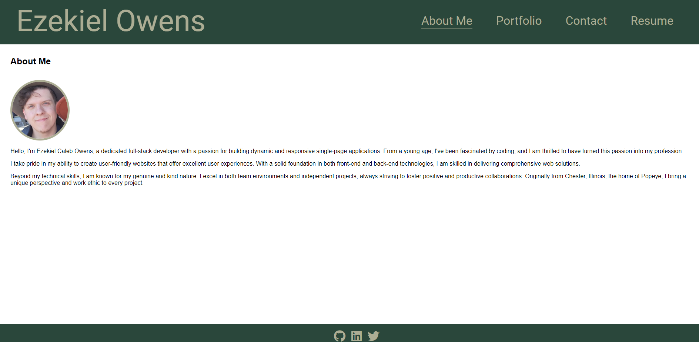
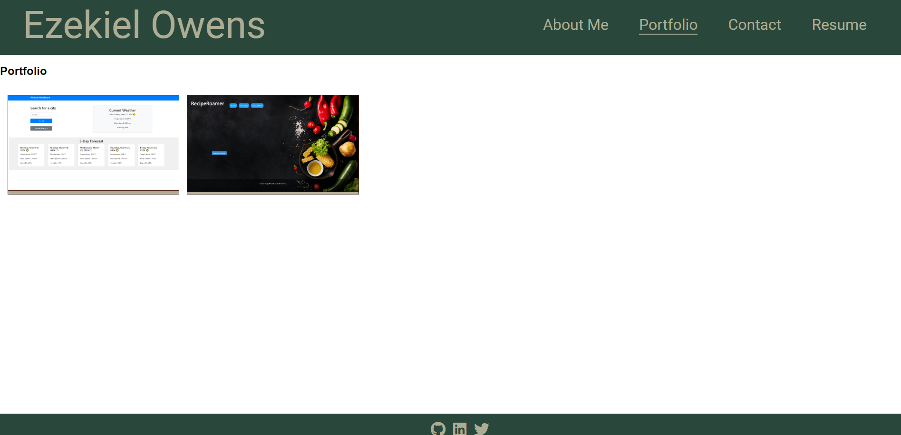

# Ezekiel Owens - Portfolio

## Table of Contents
- [Description](#description)
- [Installation](#installation)
- [Usage](#usage)
- [Features](#features)
- [Technologies](#technologies)
- [Screenshots](#screenshots)
- [Deployed Application](#deployed-application)
- [License](#license)
- [Contact](#contact)

## Description
This is a professional portfolio for Ezekiel Caleb Owens, a dedicated full-stack developer. The portfolio showcases Ezekiel's skills, projects, and provides a contact form for potential employers or collaborators to get in touch. The application is built using React and styled with custom CSS.

## Installation
To run this project locally, follow these steps:

1. **Clone the repository:**
    ```bash 
    git clone https://github.com/Octozek/Owens-portfolio.git
    ```

2. **Navigate to the project directory:**
    ```bash 
    cd Owens-portfolio
    ```

3. **Install the dependencies:**
    ```bash 
    npm install
    ```

4. **Start the development server:**
    ```bash 
    npm run dev
    ```

## Usage
Once the development server is running, you can view the portfolio by navigating to `http://localhost:3000` in your web browser.

## Features
- **About Me**: A section with a recent photo and a short bio of Ezekiel Owens.
- **Portfolio**: Showcases projects with images, titles, and links to both the deployed applications and the corresponding GitHub repositories.
- **Contact**: A form for visitors to send a message to Ezekiel Owens. Includes validation for required fields and email format.
- **Resume**: A downloadable resume and a list of proficiencies in both front-end and back-end technologies.
- **Footer**: Contains social media links to GitHub, LinkedIn, and Twitter.

## Technologies
- **React**: JavaScript library for building user interfaces.
- **Vite**: Next-generation frontend tooling for faster builds.
- **FontAwesome**: Icon library used for social media icons.
- **CSS**: Custom styles for the portfolio.

## Screenshots

*About Me Section*



*Portfolio Section*



## Deployed Application
The portfolio is deployed on Netlify and can be accessed [here](https://owens-portfolio.netlify.app/).

## License
This project is licensed under the MIT License. See the [LICENSE](LICENSE.md) file for details.

## Contact
For any inquiries, please contact Ezekiel Owens at [octozek@gmail.com](mailto:Octozek@gmail.com).
